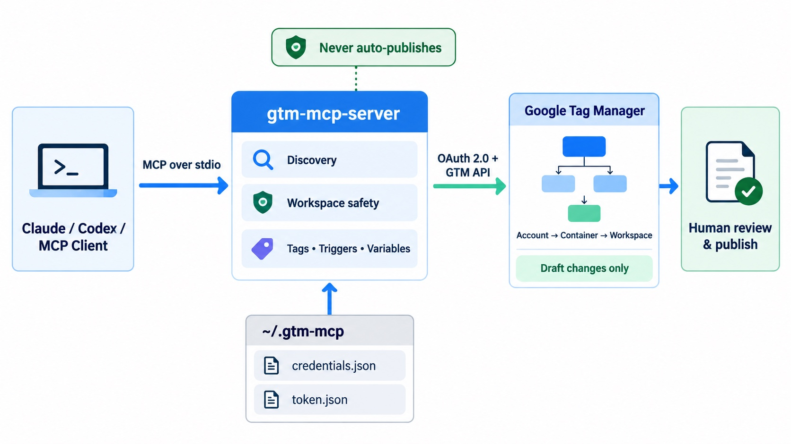

# gtm-mcp-server

An MCP (Model Context Protocol) server for safely managing Google Tag Manager workspace
drafts from Claude, Codex, or another MCP client.

The server **never publishes a container**. All changes remain in a GTM workspace for human
review. Mutating tools require an explicit workspace, use GTM fingerprints when updating or
reverting entities, and are annotated so MCP clients can distinguish reads from risky changes.

## Features

- Discover accounts, containers, and workspaces by name or ID.
- Create dedicated automation workspaces.
- List, get, create, update, delete, and revert tags, triggers, and variables.
- Inspect workspace changes/conflicts, sync with the latest version, and run a quick preview.
- Follow every Google API result page instead of silently returning only the first page.
- Reject ambiguous names and require IDs when more than one resource has the same name.
- Return both readable JSON text and MCP structured output.
- Protect partial updates by fetching the current entity, merging selected fields, and sending
  its latest fingerprint.

Writes always require `workspace`. Reads may omit it only when the container has a uniquely
identifiable Default Workspace.

## Architecture



The MCP client launches the local server over stdio. The server reads OAuth credentials and tokens
from `~/.gtm-mcp`, calls the Google Tag Manager API, and limits automated changes to workspace
drafts. A human reviews and publishes the container separately in GTM.

## What's new in v0.2

- Safe partial updates with GTM fingerprint conflict protection.
- Explicit workspace selection for every create, update, delete, revert, sync, and preview call.
- Default Workspace fallback for read-only calls.
- Complete pagination for account, container, workspace, tag, trigger, and variable listings.
- Workspace status, sync, conflict inspection, and quick preview tools.
- Secure local OAuth callback with state validation, a five-minute timeout, and restrictive token
  file permissions.
- Structured MCP responses, mutation annotations, tests, and CI.

## Requirements

- Node.js 22 or newer (required by the current Google API libraries)
- A Google Cloud project with the Tag Manager API enabled
- A Google account with access to the target GTM account/container

## 1. Create a Google OAuth client

1. Open [Google Cloud Console](https://console.cloud.google.com/) and create or select a project.
2. Enable the **Tag Manager API** under **APIs & Services → Library**.
3. Go to **APIs & Services → Credentials → Create Credentials → OAuth client ID**.
4. Select **Desktop app**.
5. Download the JSON file and save it as `~/.gtm-mcp/credentials.json`.

You can use a different location with `GTM_MCP_CREDENTIALS_PATH`.

## 2. Install

```bash
git clone https://github.com/dienhokhanh/gtm-mcp-server.git
cd gtm-mcp-server
npm ci
npm run check
```

`npm run check` builds `dist/` and runs the test suite. Run it again after pulling updates.

## 3. Sign in to Google

```bash
npm run auth
```

Open the printed Google URL and grant access. Authentication uses a temporary callback bound
only to `127.0.0.1`, validates OAuth state, and stops waiting after five minutes. The resulting
token is written to `~/.gtm-mcp/token.json` with user-only file permissions.

Version 0.2 adds the `tagmanager.edit.containerversions` scope for workspace quick preview. If
you authenticated with an older release, run `npm run auth` again to grant the new scope.

## 4. Connect an MCP client

Codex CLI or the Codex IDE extension:

```bash
codex mcp add gtm -- node "/absolute/path/to/gtm-mcp-server/dist/index.js"
codex mcp list
```

Claude Code:

```bash
claude mcp add gtm -- node "/absolute/path/to/gtm-mcp-server/dist/index.js"
claude mcp list
```

Claude Desktop (`claude_desktop_config.json`):

```json
{
  "mcpServers": {
    "gtm": {
      "command": "node",
      "args": ["/absolute/path/to/gtm-mcp-server/dist/index.js"]
    }
  }
}
```

Restart the MCP client after changing its configuration. The server communicates over stdio, so
you do not need to run `npm start` separately when the client launches `dist/index.js`.

## Workspace behavior

- Read-only tools may omit `workspace`; the server then resolves the container's Default
  Workspace.
- Mutating tools always require a workspace name or ID. You may explicitly pass `Default
  Workspace`, but a dedicated workspace is safer for automation.
- Duplicate account, container, or workspace names are rejected as ambiguous. Use the numeric ID
  returned by the corresponding list tool.
- The server can create and edit workspace drafts, but it cannot publish a container.

## Example workflows

Create a dedicated workspace and a GA4 event tag:

1. “List my GTM accounts and containers.”
2. “Create a workspace named `MCP - purchase tracking` in container `GTM-ABC123`.”
3. “Create the purchase trigger and GA4 event tag in that workspace.”
4. “Show workspace status and run a quick preview.”
5. Review and publish manually in the GTM UI.

Create a demo Meta/Facebook Pixel tag without publishing:

> In container `GTM-ABC123`, create a Custom HTML tag named `Demo - Meta Pixel` in workspace
> `MCP - demo`. Use a clearly fake pixel ID, attach the existing All Pages trigger, then show the
> workspace status. Do not publish.

Always replace demo IDs with your own values only after reviewing the generated workspace draft.

## Tools

| Area | Read-only tools | Mutating tools |
|---|---|---|
| Discovery | `gtm_list_accounts`, `gtm_list_containers`, `gtm_list_workspaces` | `gtm_create_workspace` |
| Workspace | `gtm_workspace_status` | `gtm_sync_workspace`, `gtm_quick_preview_workspace` |
| Tags | `gtm_list_tags`, `gtm_get_tag` | `gtm_create_tag`, `gtm_update_tag`, `gtm_delete_tag`, `gtm_revert_tag` |
| Triggers | `gtm_list_triggers`, `gtm_get_trigger` | `gtm_create_trigger`, `gtm_update_trigger`, `gtm_delete_trigger`, `gtm_revert_trigger` |
| Variables | `gtm_list_variables`, `gtm_get_variable` | `gtm_create_variable`, `gtm_update_variable`, `gtm_delete_variable`, `gtm_revert_variable` |

`gtm_quick_preview_workspace` creates only a temporary preview. It does not publish the container.

## Environment variables

| Variable | Default | Meaning |
|---|---|---|
| `GTM_MCP_CONFIG_DIR` | `~/.gtm-mcp` | Directory holding credentials and token |
| `GTM_MCP_CREDENTIALS_PATH` | `<config_dir>/credentials.json` | OAuth client credentials |
| `GTM_MCP_TOKEN_PATH` | `<config_dir>/token.json` | Cached OAuth token |

## Development

```bash
npm run build
npm test
npm run check
```

Unit tests cover mutation workspace requirements, GTM enum wire values, partial-update inputs,
and trigger condition validation. Live integration testing requires your own Google OAuth and
GTM test container.

## Troubleshooting

### I can see only some accounts or containers

The token belongs to the Google account selected during `npm run auth`. GTM returns only resources
that account can access. To sign in with a different Google account while keeping a recoverable
copy of the old token:

```bash
mv ~/.gtm-mcp/token.json ~/.gtm-mcp/token.backup.json
npm run auth
```

For multiple identities, give each one a separate `GTM_MCP_CONFIG_DIR` and configure that variable
for the corresponding MCP server entry.

### OAuth sign-in fails

- Confirm the downloaded credential is a **Desktop app** OAuth client, not a Web application.
- Confirm the Tag Manager API is enabled in the same Google Cloud project.
- If the OAuth consent screen is in testing mode, confirm the Google account is allowed to test it.
- If an existing token predates v0.2, run `npm run auth` again to grant the preview scope.

### A name is ambiguous

Run the relevant list tool and retry with the returned numeric account, container, or workspace ID.
The server intentionally refuses to guess when multiple resources have the same name.

## Security notes

- Never commit OAuth credentials or tokens. Common credential, token, and environment filenames
  are covered by `.gitignore`; keep custom secret paths outside the repository too.
- Use a dedicated GTM workspace for automated changes.
- Inspect `gtm_workspace_status` and run `gtm_quick_preview_workspace` before publishing.
- Publishing remains a manual action in the GTM UI.
- Tokens are still local bearer credentials: only run this server on a trusted machine.

## About PPC Blog Pro

`gtm-mcp-server` is an open-source project from [PPC Blog Pro](https://ppcblogpro.com/), an
independent resource for PPC professionals covering Google Ads, Meta Ads, AI-assisted campaign
management, analytics, and conversion tracking.

## License

MIT
